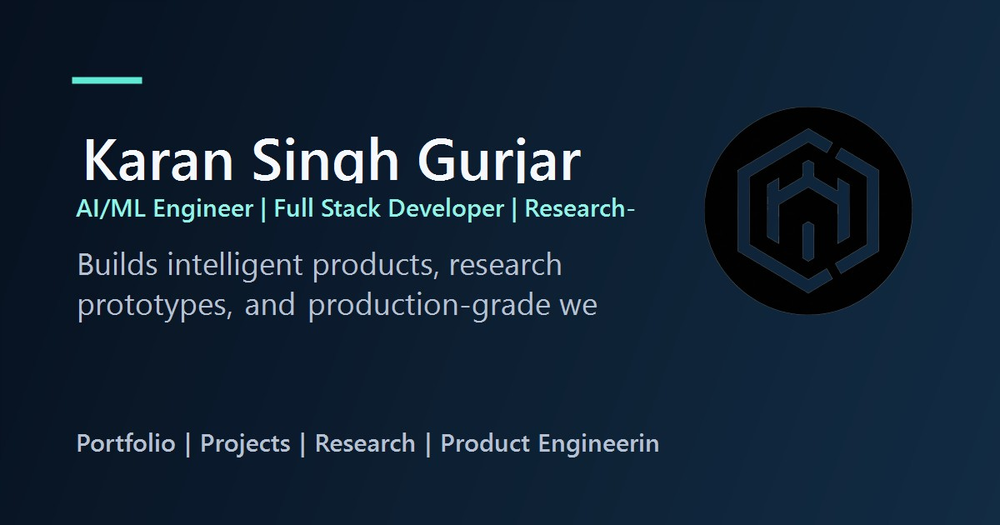

# Karan Singh Gurjar Portfolio

Professional portfolio website for presenting AI/ML engineering, research-led builds, and full stack product work in a recruiter-friendly format.

Live site: https://karansinghgurjar.github.io/ksg_portfolio/

## Overview

This project is a polished single-page portfolio and projects showcase built to communicate:

- professional positioning and availability
- case-study style project evidence
- experience, capability mapping, and research credibility
- recruiter-friendly contact and trust signals

The codebase is organized as reusable React components with route-level views, shared data modules, custom hooks, and a small design system for consistent light and dark mode presentation.

## Stack

- React 18
- Vite
- Tailwind CSS
- PostCSS + Autoprefixer
- GitHub Pages

## Features

- professional hero and value proposition section
- featured projects and full case-study projects page
- timeline-style experience section with proof points
- capability-mapped skills section with project relationships
- recruiter-focused contact and trust section
- theme preference support with light, dark, and system modes
- route-aware SEO metadata and social sharing tags
- keyboard-friendly navigation, skip link, and visible focus states
- reduced-motion support for accessibility

## Project Structure

```text
src/
  components/
    common/
    home/
    layout/
  data/
  hooks/
  pages/
  styles/
  utils/
```

## Screenshots

Primary preview image used for sharing:



## Local Setup

Install dependencies:

```bash
npm install
```

Run the development server:

```bash
npm run dev
```

Vite usually serves locally at:

```text
http://localhost:5173/ksg_portfolio/
```

## Production Build

```bash
npm run build
```

## Deployment

The site is configured for GitHub Pages deployment from the `main` branch.

```bash
npm run deploy
```

## Accessibility and UX Notes

- semantic sections and landmarks
- screen-reader labels for icon-only controls
- visible focus states across navigation and actions
- reduced-motion support for users who prefer less animation
- active navigation and smooth section scrolling

## Future Improvements

- add dedicated per-project pages with richer media
- introduce automated accessibility and Lighthouse checks
- add content-managed writing or engineering notes if needed
- expand trust signals with stronger publication and certification coverage
